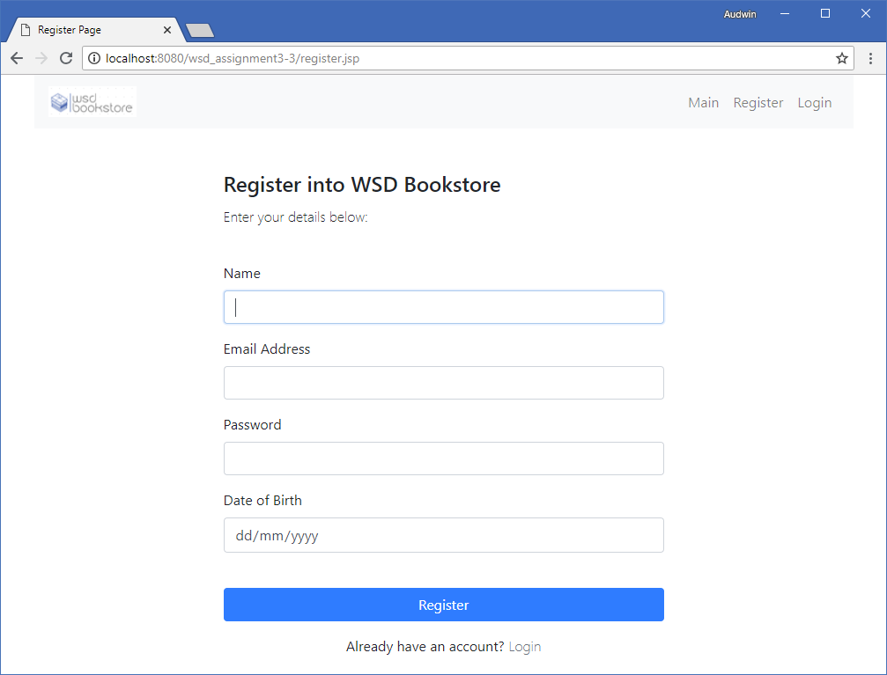
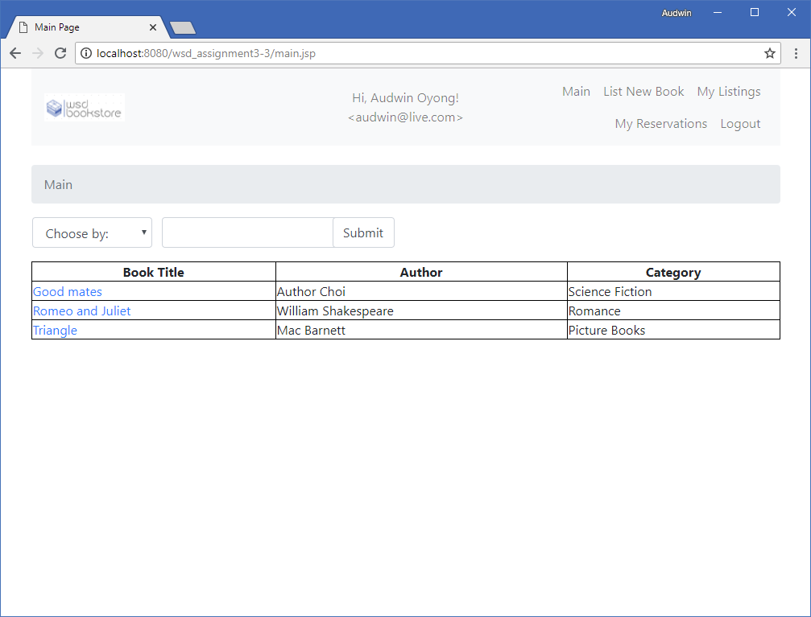
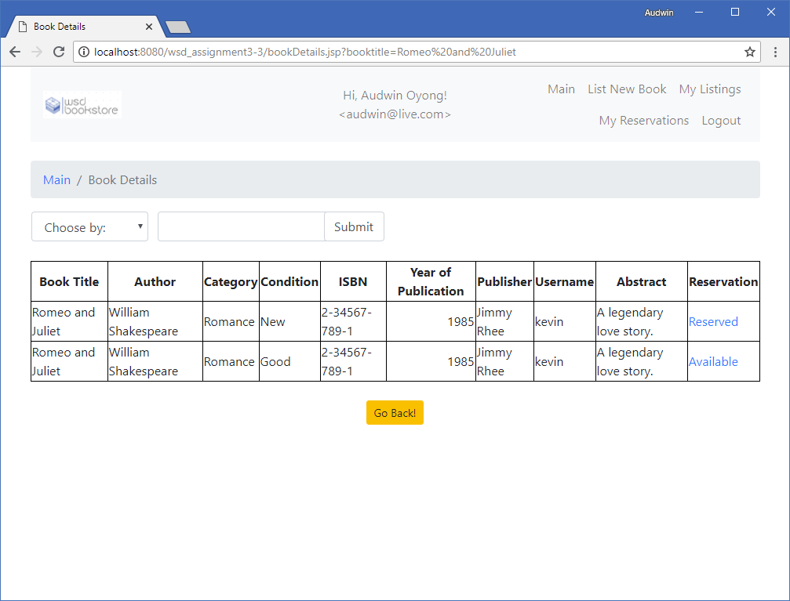
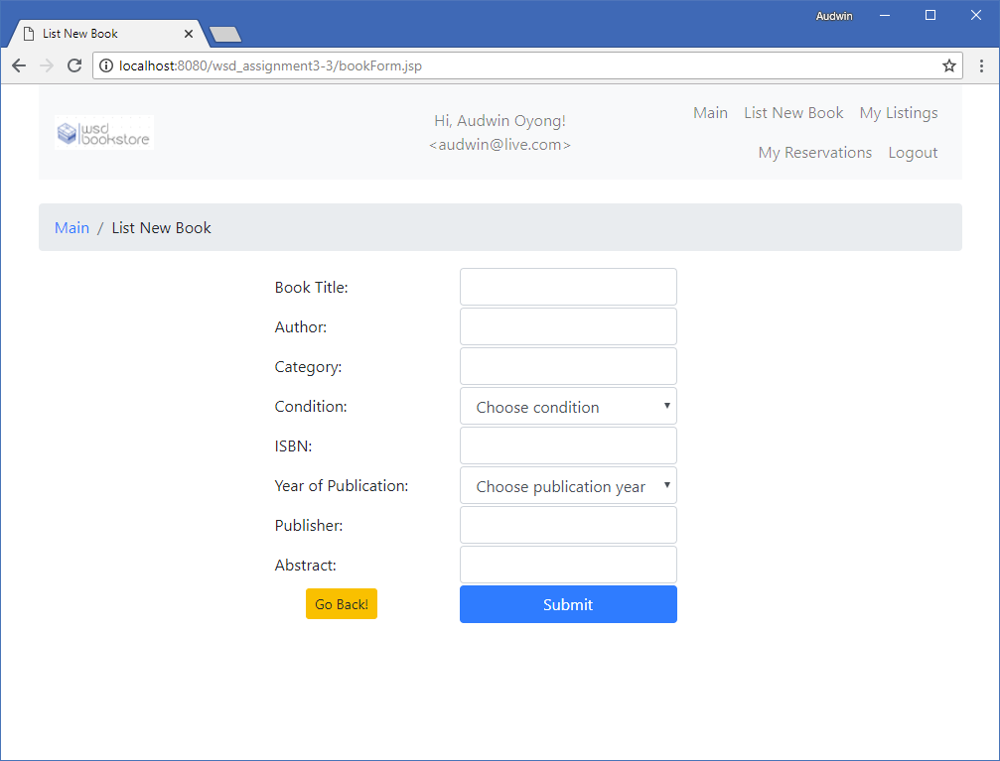
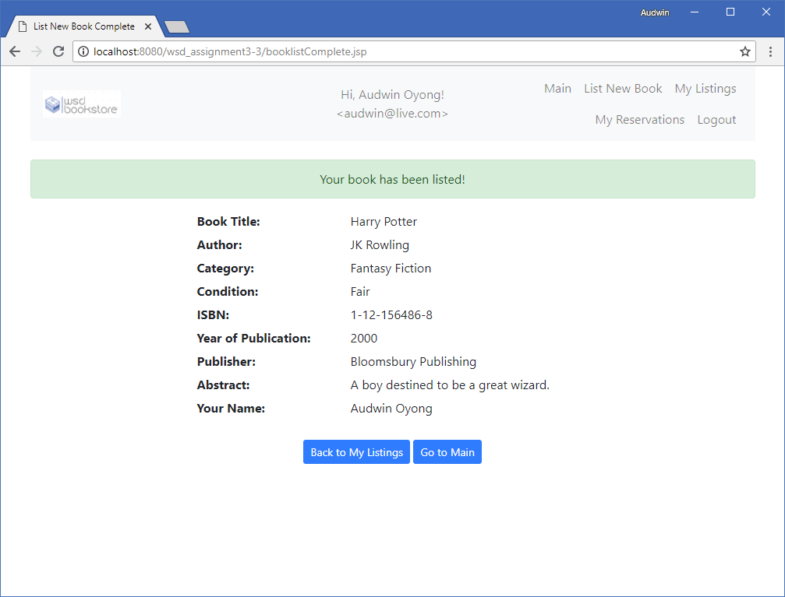
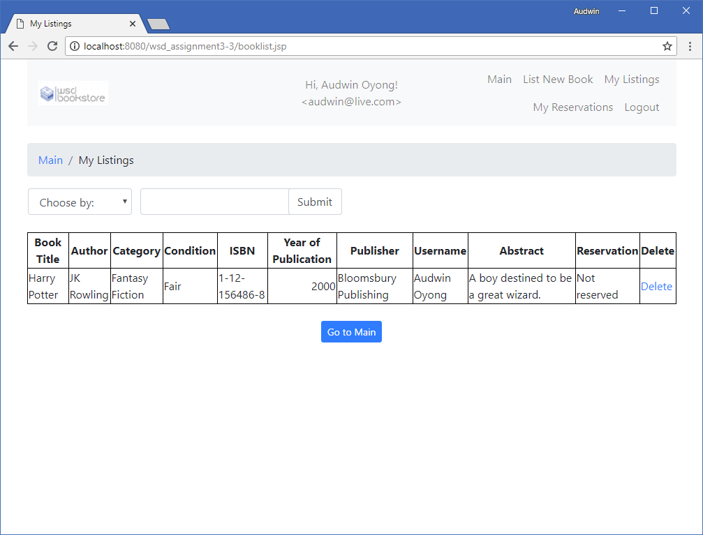
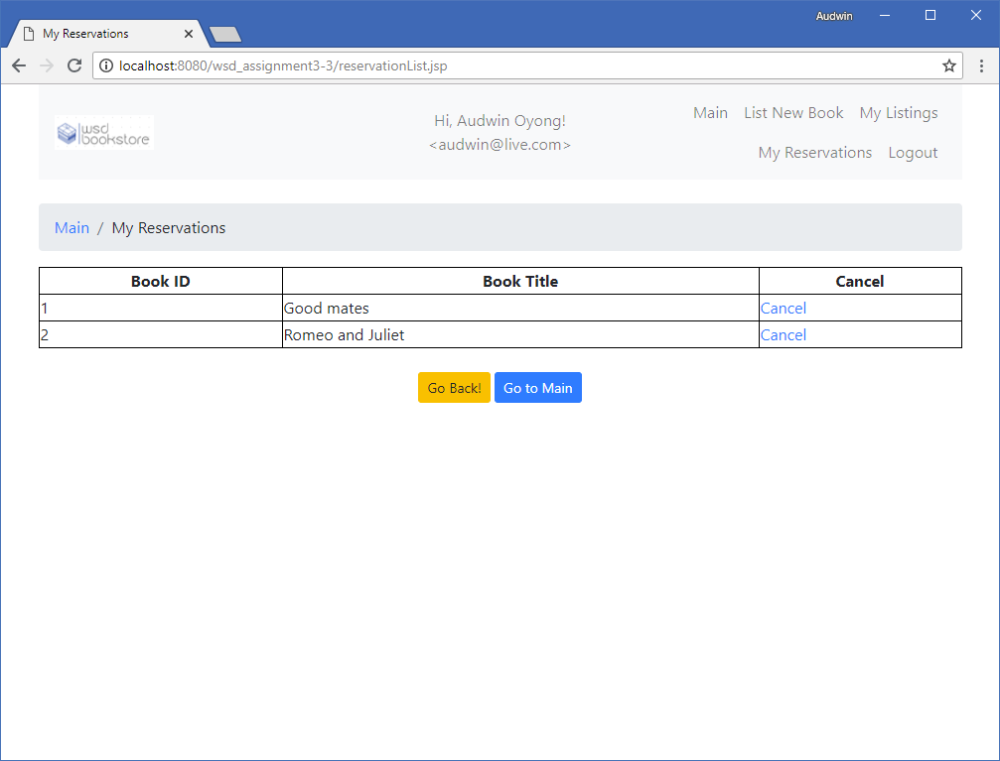

# WSD Bookstore

A group project of web application for listing secondhand textbooks.

This project was created for **31284 Web Services Development** course at UTS.

## Features

* Java Server Pages (JSP)
* XML Schema validation (XSD)
* XSLT transformations
* Search Filters
* REST and SOAP web services

## Previews

  

  

  

  

  

  

  

